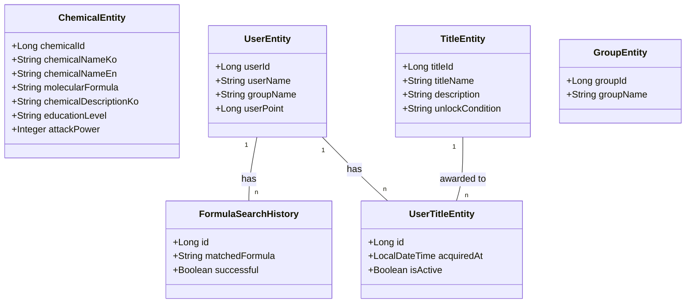

[ATOMIX_10팀 PDF 문서](ATOMIX_10팀.pdf)


# 🧪 화합물 검색 및 교육 서비스 API

## 📝 개요

이 프로젝트는 화학 물질을 검색하고 학습할 수 있는 교육용 서비스를 위한 백엔드 API입니다. 사용자는 화학 원소 조합을 입력하여 화학 물질을 검색하고, 발견한 화학 물질에 따라 칭호를 획득하며, 개인 및 조직 랭킹에 참여할 수 있습니다.

## ✨ 주요 기능

### 🔍 화학 물질 검색
- 화학 원소 조합 입력 (예: "h + h + o")으로 화학 물질 검색
- 표준 화학식 변환 및 다양한 표기법 지원 (예: H2O, OH2)
- 익명 또는 사용자 인증 기반 검색 지원

### 👤 사용자 관리
- 사용자 등록 및 프로필 관리
- 사용자별 포인트 시스템
- 조직(학교) 소속 관리

### 🏆 칭호 시스템
- 화학 물질 발견에 따른 자동 칭호 부여
- AI 기반 맞춤형 칭호 생성
- 칭호 관리 및 활성화

### 🥇 랭킹 시스템
- 개인별 화학 물질 발견 랭킹
- 조직별 화학 물질 발견 랭킹

### 📊 보고서 및 분석
- 사용자 화학 활동 분석 보고서
- AI 기반 보고서 생성

## 🔌 API 엔드포인트

<details>
<summary><b>화학 물질 API</b></summary>

- `POST /chemical/formula/search`: 사용자 ID 제공하여 화학식 검색 (랭킹에 포함)
- `POST /chemical/formula/search/anonymous`: 익명으로 화학식 검색
- `GET /chemical/user/formulas/{userId}`: 사용자가 발견한 모든 화학식 조회
</details>

<details>
<summary><b>사용자 API</b></summary>

- `POST /user/register`: 사용자 등록
- `GET /user/getUsernameById/{userId}`: 사용자 ID로 닉네임 조회
- `GET /user/getIdByUsername/{userName}`: 사용자 닉네임으로 ID 조회
</details>

<details>
<summary><b>포인트 API</b></summary>

- `POST /point`: 포인트 추가/차감
- `GET /point/search/{userName}`: 사용자 포인트 조회
</details>

<details>
<summary><b>칭호 API</b></summary>

- `GET /title/{userId}`: 사용자의 모든 칭호 목록 조회
- `POST /title/{userId}/activate/{titleId}`: 특정 칭호 활성화
- `GET /title/ai/{userId}`: AI 생성 맞춤형 칭호 목록
- `POST /title/ai/{userId}/save`: AI 생성 칭호 저장
</details>

<details>
<summary><b>랭킹 API</b></summary>

- `GET /ranking`: 상위 10명의 개인 랭킹과 상위 10개 조직 랭킹 조회
</details>

<details>
<summary><b>보고서 API</b></summary>

- `GET /report/{userId}`: 사용자의 화학 활동 분석 보고서 생성
</details>

<details>
<summary><b>도감 API</b></summary>

- `GET /collection/find/all`: 모든 물질 정보 조회
- `GET /collection/find/{molecularFormula}`: 화학식으로 특정 물질 정보 조회
</details>

## 🛠 기술 스택

<div align="center">
  
## 기술 스택

### 백엔드
- 
- 
- 
- 

### 인프라
- 

### 개발 도구
- 
- 

### 협업 툴
- 
- 

### 문서화
- 

</div>

## 📊 모델 구조



## 🧪 화학식 검색 알고리즘

1. 사용자 입력 파싱 (예: "h + h + o" → {"H": 2, "O": 1})
2. 가능한 화학식 조합 생성 (예: H2O, OH2)
3. 데이터베이스에서 일치하는 화학 물질 검색
4. 결과 반환 및 검색 이력 저장
5. 성공 시 칭호 체크 및 부여

## 🚀 시작하기

### 필수 조건

- Java 17
- Maven 또는 Gradle
- 데이터베이스 (MySQL/PostgreSQL)
- OpenAI API 키 (AI 기능용)

### 설치

```bash
# 저장소 클론
git clone https://github.com/yourusername/your-repo-name.git

# 디렉토리 이동
cd your-repo-name

# 의존성 설치
./mvnw install

# 애플리케이션 실행
./mvnw spring-boot:run
```

## 🤝 기여 방법

1. 이 저장소를 포크합니다.
2. 새 기능 브랜치를 만듭니다 (`git checkout -b feature/amazing-feature`).
3. 변경 사항을 커밋합니다 (`git commit -m 'Add some amazing feature'`).
4. 브랜치를 푸시합니다 (`git push origin feature/amazing-feature`).
5. Pull Request를 열어주세요.

## 📝 라이센스

이 프로젝트는 [MIT 라이센스](LICENSE)를 따릅니다.

---

<div align="center">
  <sub>대전 해커톤 2024에서 개발</sub>
</div>

개발사진


